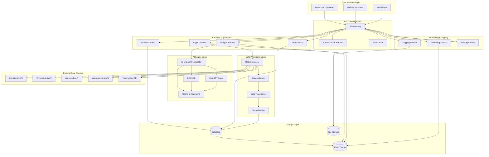
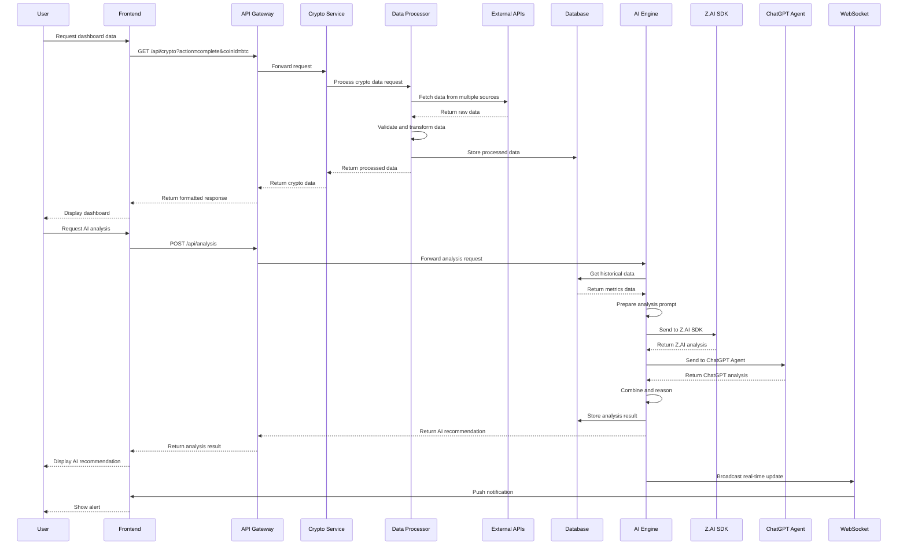
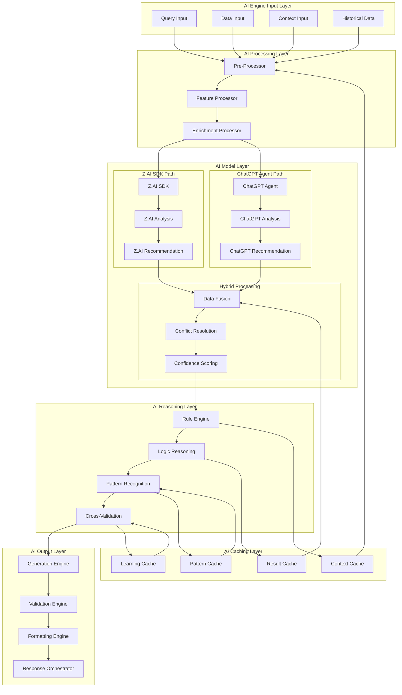
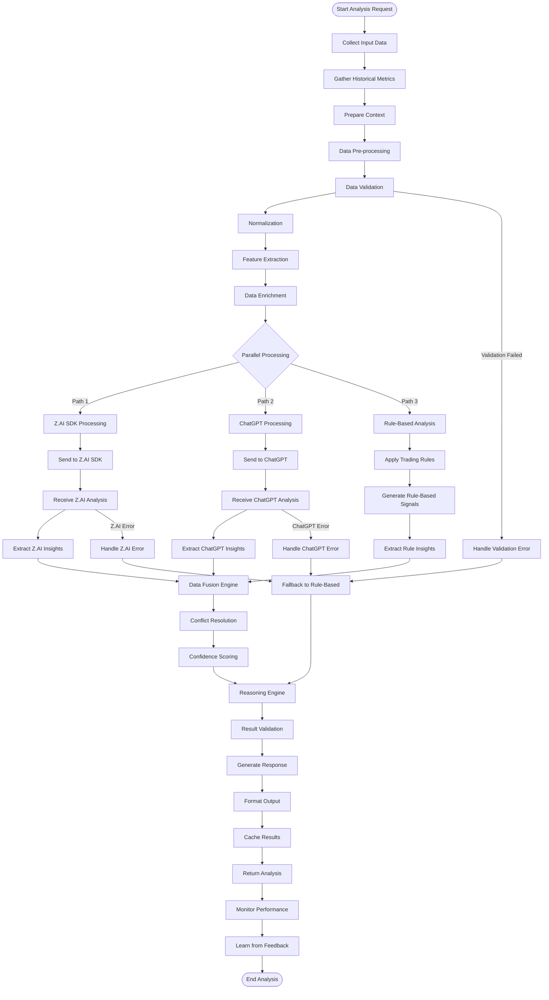
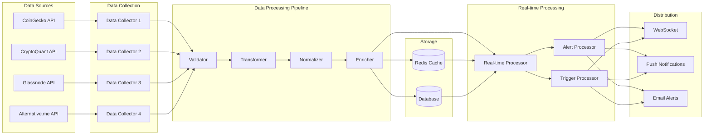
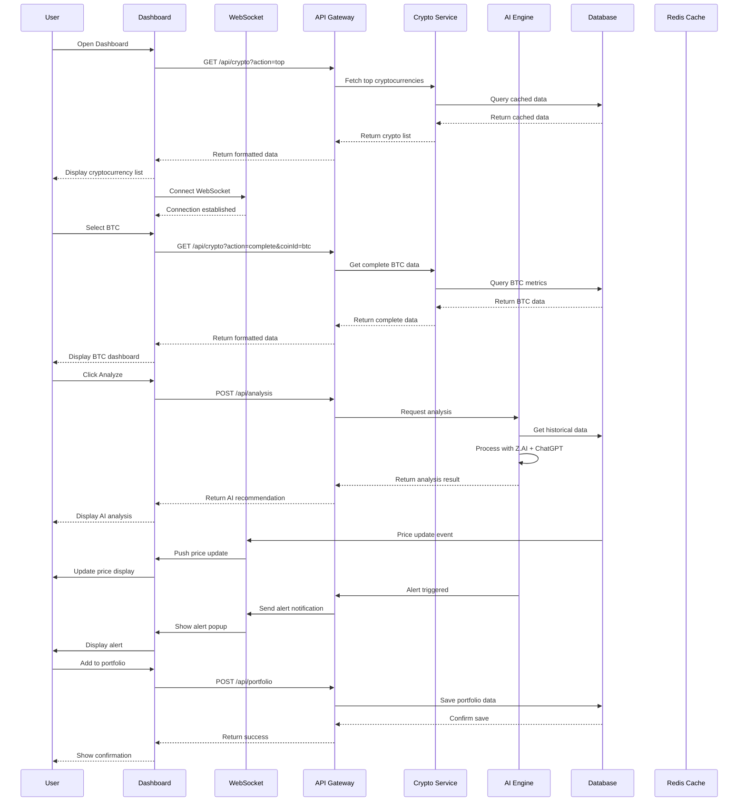
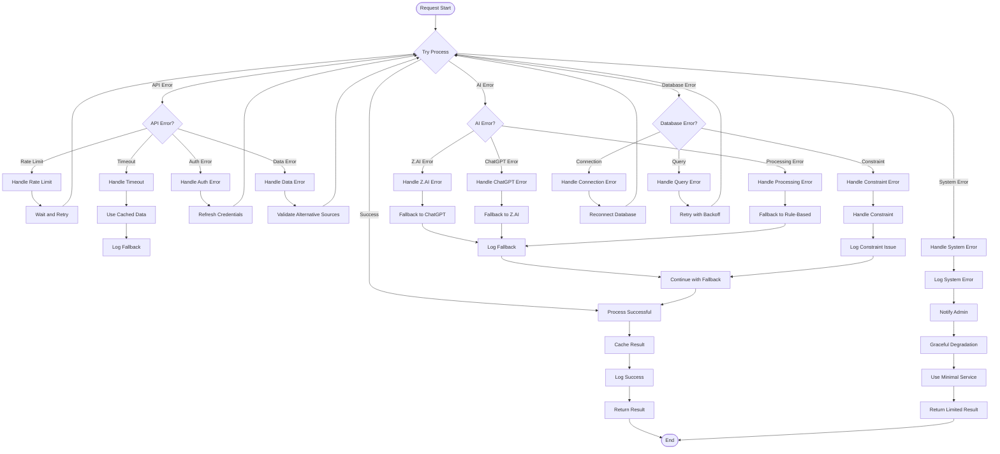
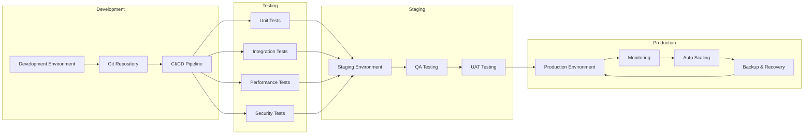
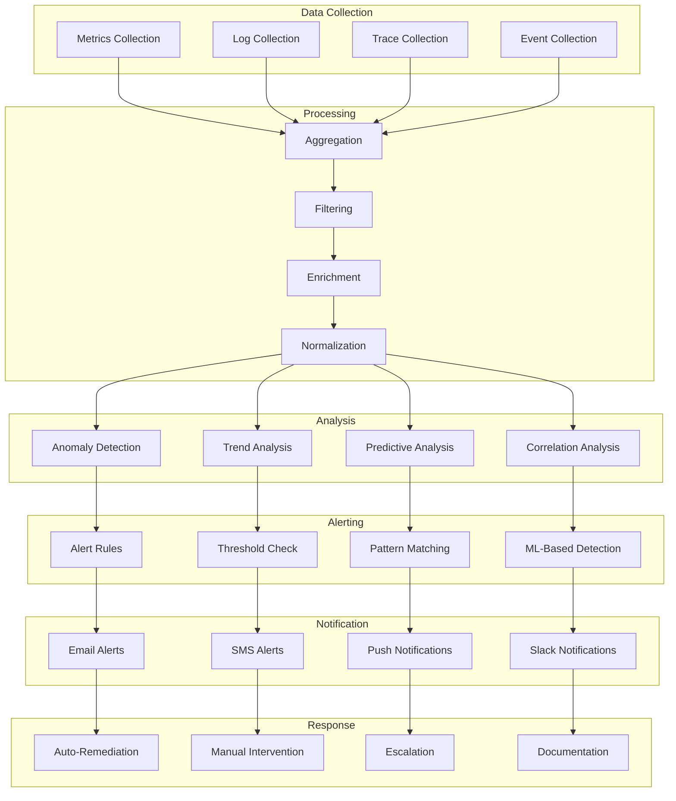
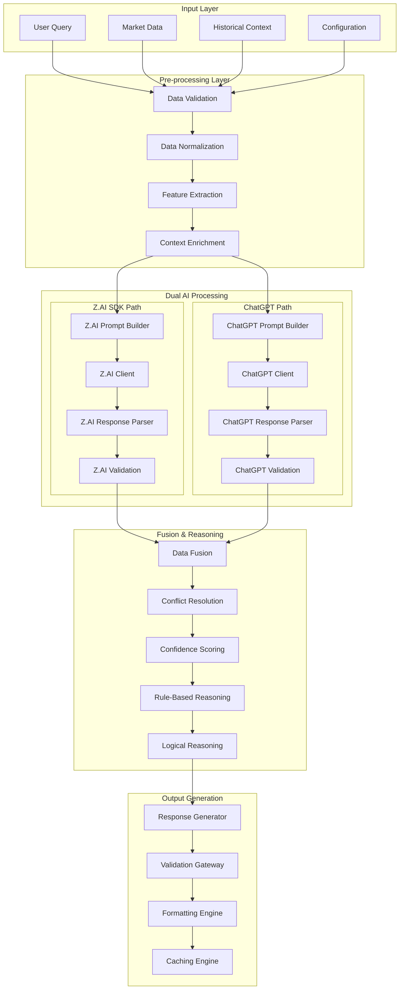

# FLOWCHART HỆ THỐNG CRYPTO MARKET ANALYTICS DASHBOARD

**Ngày:** 25/12/2024  
**Phiên bản:** 1.0  
**Product Owner:** [Tên của bạn]  
**Developer:** Z.AI  

---

## 1. FLOWCHARCH TỔNG QUAN HỆ THỐNG



---

## 2. FLOWCHART DATA FLOW



---

## 3. FLOWCHART AI ENGINE ARCHITECTURE



---

## 4. FLOWCHART AI ENGINE DETAILED WORKFLOW



---

## 5. FLOWCHART REAL-TIME DATA PROCESSING



---

## 6. FLOWCHART USER INTERACTION FLOW



---

## 7. FLOWCHART ERROR HANDLING & RECOVERY



---

## 8. FLOWCHART DEPLOYMENT PIPELINE



---

## 9. FLOWCHART MONITORING & ALERTING



---

## 10. AI ENGINE IMPLEMENTATION DETAILS

### 10.1 AI Engine Architecture



### 10.2 AI Engine Code Structure

```
src/lib/ai-engine/
├── core/
│   ├── ai-engine.ts          # Main AI Engine orchestrator
│   ├── types.ts              # Type definitions
│   ├── interfaces.ts         # Interface definitions
│   └── constants.ts          # Constants and configuration
├── processors/
│   ├── input-processor.ts    # Input data processing
│   ├── zai-processor.ts      # Z.AI SDK processing
│   ├── chatgpt-processor.ts  # ChatGPT processing
│   └── fusion-processor.ts   # Data fusion and reasoning
├── analyzers/
│   ├── technical-analyzer.ts # Technical analysis
│   ├── onchain-analyzer.ts   # On-chain analysis
│   ├── sentiment-analyzer.ts  # Sentiment analysis
│   └── risk-analyzer.ts      # Risk analysis
├── validators/
│   ├── data-validator.ts     # Data validation
│   ├── response-validator.ts # Response validation
│   └── confidence-validator.ts # Confidence validation
├── generators/
│   ├── prompt-generator.ts   # Prompt generation
│   ├── response-generator.ts # Response generation
│   └── report-generator.ts   # Report generation
├── cache/
│   ├── cache-manager.ts      # Cache management
│   ├── context-cache.ts      # Context caching
│   └── result-cache.ts       # Result caching
└── utils/
    ├── error-handler.ts      # Error handling
    ├── logger.ts             # Logging
    └── helpers.ts            # Helper functions
```

---

## 11. KẾT LUẬN

Flowchart hệ thống đã được thiết kế chi tiết với các thành phần chính:

1. **Tổng quan kiến trúc:** Multi-layer architecture với rõ ràng separation of concerns
2. **Data flow:** Quy trình xử lý dữ liệu từ nguồn đến người dùng
3. **AI Engine:** Dual AI processing với Z.AI SDK và ChatGPT Agent
4. **Real-time processing:** Xử lý dữ liệu thời gian thực
5. **User interaction:** Luồng tương tác người dùng chi tiết
6. **Error handling:** Xử lý lỗi và recovery mechanism
7. **Deployment:** Pipeline triển khai và monitoring
8. **AI Engine:** Architecture chi tiết với implementation structure

Hệ thống được thiết kế để:
- **Scalable:** Có thể mở rộng dễ dàng
- **Reliable:** Có cơ chế xử lý lỗi và fallback
- **Performant:** Tối ưu performance với caching và real-time processing
- **Maintainable:** Code structure rõ ràng và modular
- **Secure:** Có các lớp bảo mật và validation

Bạn có muốn tôi điều chỉnh hoặc bổ sung bất kỳ phần nào trong flowchart không?